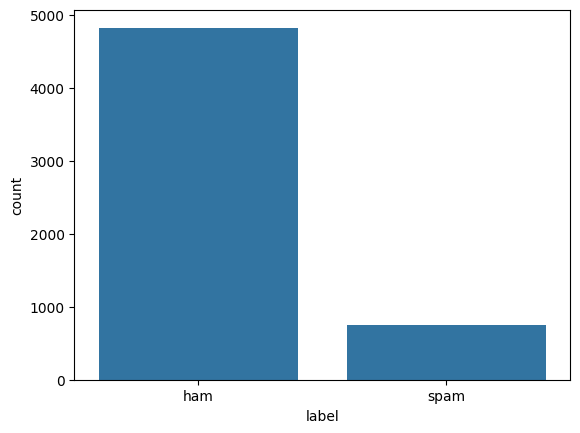
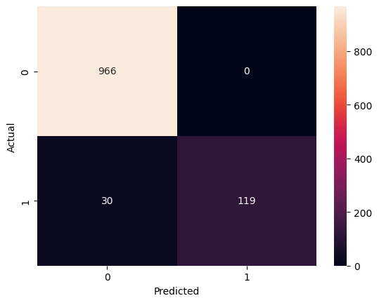

# Spam Mail Detector

## Project Overview

This machine learning project classifies SMS messages as Spam or Ham (Not Spam) using Natural Language Processing (NLP) techniques and a Naive Bayes classifier.

## Dataset

SMS Spam Collection Dataset from the UCI Machine Learning Repository.

## Technologies Used

* Python
* Pandas
* NumPy
* Matplotlib
* Seaborn
* NLTK
* Scikit-Learn

## Workflow

1. Load SMS dataset
2. Text preprocessing

   * Lowercasing
   * Tokenization
   * Stopword removal
3. Feature extraction using TF-IDF
4. Train-Test Split
5. Naive Bayes Classification
6. Performance Evaluation

## Results

- Accuracy: 97%
- Ham F1-Score: 0.98
- Spam F1-Score: 0.89

The Naive Bayes classifier successfully identified spam and ham messages with an overall accuracy of 97%. The model achieved perfect spam precision (1.00), meaning every message predicted as spam was actually spam. The spam recall score of 0.80 indicates that most spam messages were detected, though some spam messages were still classified as ham.

### Confusion Matrix

## Sample Predictions

Spam Example:
"Congratulations! You have won a free iPhone. Click now."

Ham Example:
"Mom, I will be home at 7 PM."

## Skills Learned

* Natural Language Processing (NLP)
* Text Cleaning
* Tokenization
* Stopword Removal
* TF-IDF Feature Extraction
* Naive Bayes Classification
* Model Evaluation

## Author

Aadipta Sengupta
